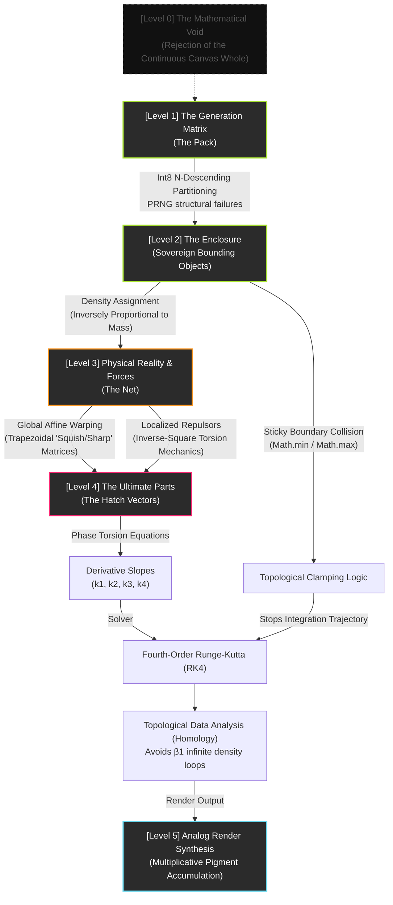

# Eros Engine: Ontological & Mereological Art Heuristics (v2)

**Target Aesthetic:** Ben Kovach - *Edifice* (Brutalist, high-tension, plotter-like abstract geometry)
**Philosophical Doctrine:** Object-Oriented Ontology & Mereological Tectonics
**Status:** Canonical Ground-Truth (Version 2.0)

*(This constitution strictly overrides naive generative scripting, establishing Eros as an engine of part-to-part emergence devoid of top-down canvas reductionism. Continuous noise operations like Perlin/Simplex are strictly prohibited).*

---

## 0. The Philosophy of Mereological Autonomy
The Eros engine structurally rejects the concept of a master "canvas" (a reductionist whole). Instead, space exists only as the terminal accumulation of microscopic, local coordinate interactions (Tristan Garcia / Daniel Koehler). Form emerges brutally through the tension between **strictly discrete architectural spatial matrices** and **autonomous fractional vectors** crashing into absolute theoretical boundaries. 

To manage unpredictable algorithm state collapses ("Unknown Unknowns"), we integrate Topological Data Analysis (TDA) and strictly evaluate spatial derivatives via Fourth-Order Runge-Kutta (RK4) integrations, achieving plotter precision.

---

## 1. The Ontological Taxonomy Tree

This graph defines the exact operational and mereological derivation of the artwork. Every algorithm inside `edifice.js` must resolve to one of these five specific cascading layers.



---

## 2. Comprehensive Algorithmic Heuristics & Equations

### [Level 1] The Space Generation Matrix (The Pack)
Naive grids are completely discarded for recursive, monolithic partitioning.
* **Mechanism:** N-Descending Topological Space Partitioning via an `Int8Array`. Iterating backwards forces extreme scale variances—massive monoliths bordering microscopic shard-spaces.
* **The Failure Injection Equation:** Perfect mathematical structure is intentionally broken to forge uneven spatial variance. 
  ```javascript
  const valid = checkZeroDimensionalOverlap(grid, x, y, N);
  const structuralFailure = prng.next() > 0.42;
  if (valid && (structuralFailure || N === 1)) {
      allocateEnclosure(x, y, N);
  }
  ```

### [Level 2] The Enclosure & Topological Limits
Each space is a highly specific object possessing independent traits (`mass`, `base phase`, `friction`).
* **Micro-Shrapnel Inverse Density:**
  Smaller bounding rectangles lack structural integrity and shatter. Density scales inversely with area to simulate this physical fracture.
  ```javascript
  let mass = enclosure.w * enclosure.h;
  let lineCount = Math.floor((15000 / Math.sqrt(mass)) * prng.next());
  ```
* **Strict Topological Clamping:**
  Ink vectors must collide *inelasticly* with bounding fault lines, ensuring mereological sovereignty. If the vector intersects boundaries formed by the parent `Enclosure`, the velocity becomes zero `0` *prior* to any affine warp.

### [Level 3] Physical Reality & Generative Forces (The Net)
The grid must erode using distinct algorithmic formulas representing literal calculation fatigue. 
* **Inverse-Square Torsion (Local Forces):**
  Instead of fluid noise, objects repulse integrating vectors using true gravitational physics.
  ```javascript
  let force = point.mass / (15.0 + Math.pow(distance, 2));
  torsion[Axis] += radius[Axis] * force;
  ```
* **Affine 'Squish' and 'Sharp' Shears (Global Matrices):**
  The canvas geometry dynamically shears to warp the rectilinear nature of the initial pack. Parity-based horizontal scaling is a core signature of the brutalist blueprint esthetic.
  ```javascript
  const rowParity = Math.floor(px.y * 0.04) % 2;
  const squishScale = (rowParity === 0) ? 1.4 : 0.6; // Creates distinct trapezoidal warping
  ```

### [Level 4] The Ultimate Parts & Trajectories (The Hatch)
True volumetric depth and tension are resolved entirely via overlapping vectors. Euler integration fails structurally here; it introduces discretization error around the inverse-square singularities.
* **The Differential Equations (Localized Flow):**
  ```javascript
  const derivative = (lx, ly) => ({
      vx: Math.cos(enclosure.phase) + Math.sin(ly * 0.02),
      vy: Math.sin(enclosure.phase) + Math.cos(lx * 0.02) // Pure mathematical derivatives
  });
  ```
* **Fourth-Order Runge-Kutta (RK4) Solver Mechanism:**
  ```javascript
  // RK4 fractions the slope 4 times for hyper-stability in tight spirals
  k1 = derivative(x, y);
  k2 = derivative(x + 0.5 * h * k1.vx, y + 0.5 * h * k1.vy);
  k3 = derivative(x + 0.5 * h * k2.vx, y + 0.5 * h * k2.vy);
  k4 = derivative(x + h * k3.vx, y + h * k3.vy);
  x_next = x + (h / 6) * (k1.vx + 2*k2.vx + 2*k3.vx + k4.vx);
  ```
* **Topological Data Analysis (TDA) Intervention:**
  To combat "Unknown Unknowns" (mathematical black-holes caused by inverse compounding), Eros monitors Betti numbers ($\beta_0$ for connected parts, $\beta_1$ for cyclic structural holes). If $\beta_1$ hits infinity (an endless loop trap), integration is artificially terminated.

### [Level 5] Analog Render Synthesis
The engine mimics precise analytical blueprints plotting layer over layer over layer.
* **Canvas Parameters:** The vector path accumulation dictates final texture darkness against empty repulsed voids.
  ```javascript
  ctx.globalCompositeOperation = 'multiply';
  ctx.lineWidth = 0.45;
  ctx.strokeStyle = `hsla(215, 30%, 25%, 0.04)`;
  // 0.04 alpha guarantees intense visual density only where physical overlap is extreme
  ```
